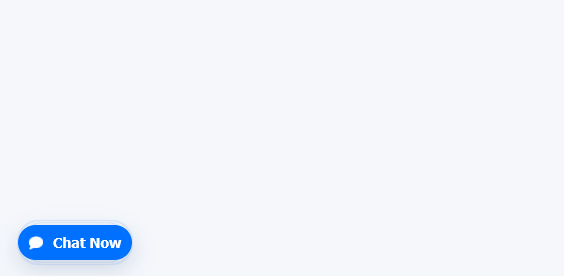

# 💬 Sales Support Agent Chat Integration

A sleek and responsive **Sales Support Agent Chat Form** built to simplify customer communication.  
Users can easily send their inquiries through a simple form — while receiving **real-time feedback** on the submission status.

---

## ✨ Features

### 🧾 Form Fields
Collect essential information from users effortlessly:
- 👤 **Name**
- 📧 **Email**
- 📱 **Phone Number**
- 💬 **Message / Inquiry**

### ⚡ Response System
Provide users with instant and meaningful feedback:
- ✅ **Success Message** — when the inquiry is sent successfully.
- ❌ **Error Message** — if something goes wrong during submission.

### 🖥️ Real-Time Interaction
- Users get a **responsive experience** with real-time form validation and visual feedback.
- A **“Chat Now”** button triggers the inquiry or opens the chat form seamlessly.

---

## 🚀 How It Works

1. The user fills in all required details in the form.
2. Upon clicking the **Send / Chat Now** button:
   - The system validates inputs.
   - Processes the request asynchronously.
   - Displays the appropriate response message (success or error).
3. The sales team receives an **email inquiry** instantly.

---

## 🖼️ Screenshots

### 🪄 Sales Support Chat Form
This is where the user provides their contact details and inquiry:


### 💬 Chat Now Button
A clear and inviting button to initiate the chat:


### 📩 Email Inquiry Example
Sales team receives the message instantly in their inbox:


### ⚠️ Error Response
If submission fails, the user is informed with a clear message:
*(Example illustration below)*


### 🎉 Success Response
A confirmation message assures the user their message was delivered:


---

## ⚙️ Installation

Follow these steps to get started locally:

```bash
# Clone this repository
git clone (https://github.com/iamishtiaq98/chat-box-custom-html-css.git)

# Navigate into the project directory
cd sales-support-agent-chat

# Install dependencies
npm install

# Start the development server
npm start
```

Then open your browser at **http://localhost:3000** 🚀

---

## 🧑‍💻 Contributing

We welcome all contributions! 🎉

1. Fork this repository
2. Create your feature branch (`git checkout -b feature/AmazingFeature`)
3. Commit your changes (`git commit -m 'Add some AmazingFeature'`)
4. Push to the branch (`git push origin feature/AmazingFeature`)
5. Open a Pull Request

💡 *Feel free to report bugs, suggest improvements, or submit pull requests.*

---

## 📄 License

This project is licensed under the **MIT License** — see the [LICENSE](./LICENSE) file for details.

---

## ❤️ Acknowledgments

- Built with **Node.js**, **Express**, and **modern web practices**.
- Designed for **fast response and better customer experience**.
- Inspired by the need for seamless **sales support integration**.
